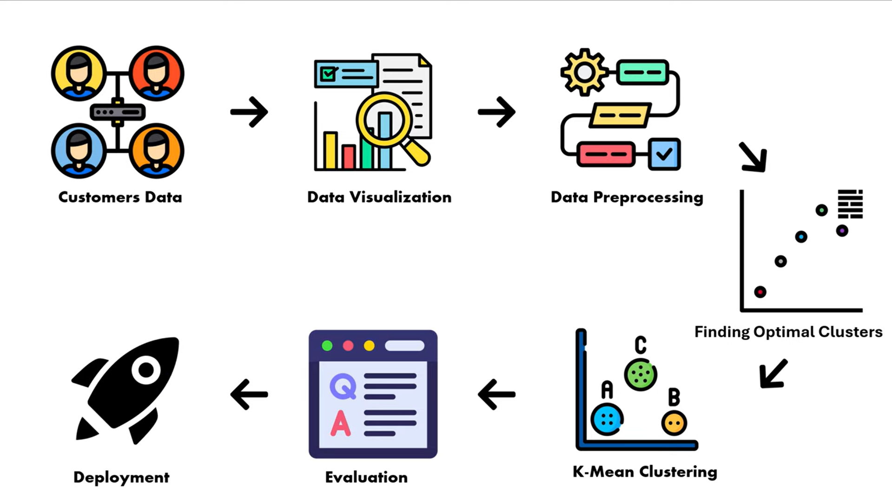
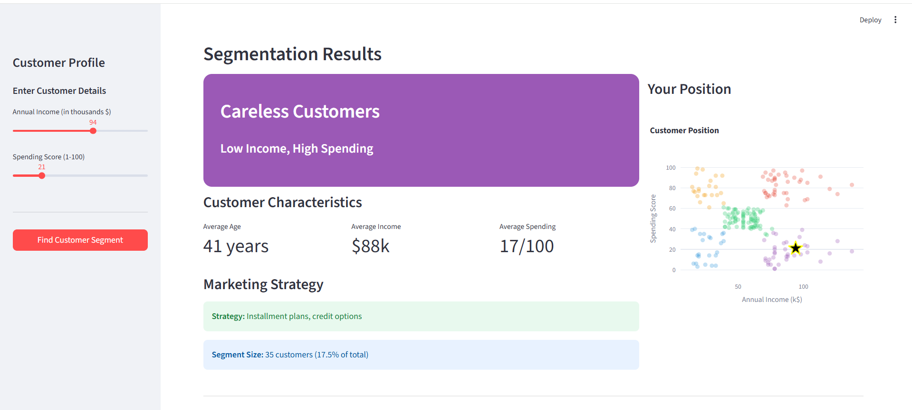
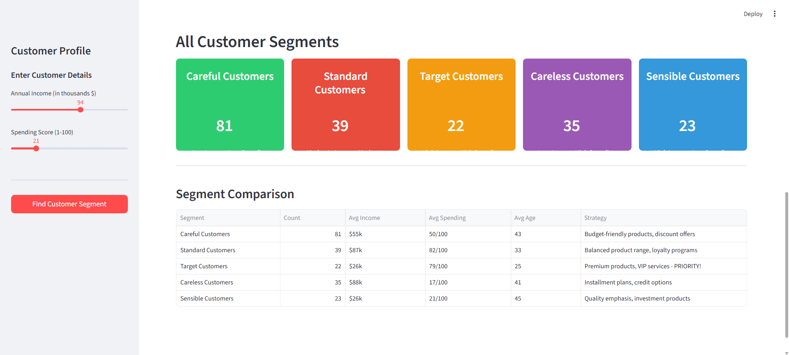
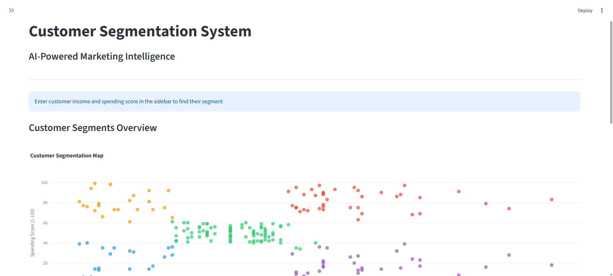
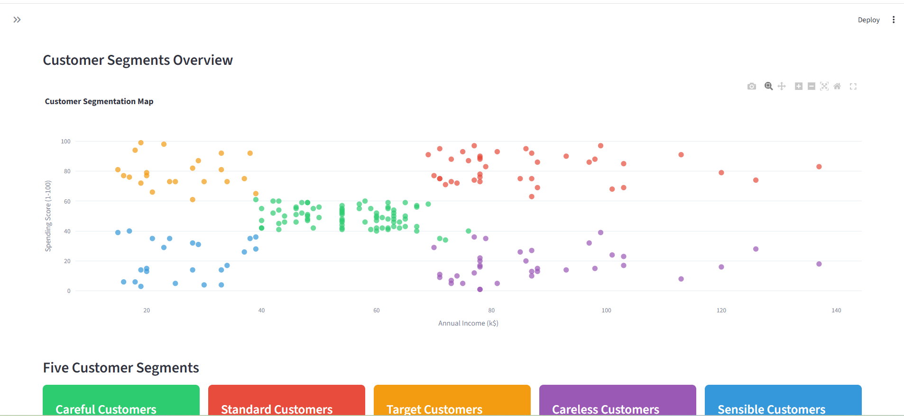
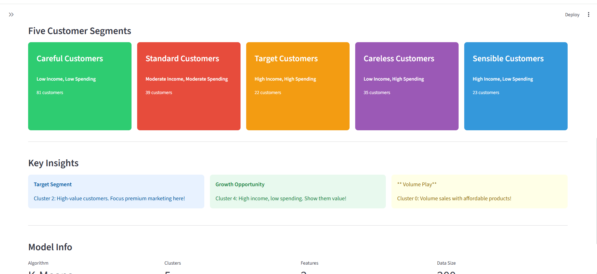
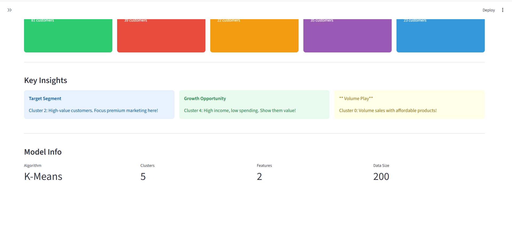

# 🧠 Customer Segmentation using K-Means Clustering


Build a **complete, professional unsupervised machine learning project** from scratch!  
This project demonstrates **Customer Segmentation** using **K-Means Clustering** with Python and Scikit-learn.  
Perfect for beginners exploring **Unsupervised Learning** and for building a **strong ML portfolio project**.

---

## 📌 Project Highlights

- Complete source code
- Real-world dataset (Mall_Customers.csv)
- Trained K-Means model (`.pkl`)
- All EDA & clustering visualizations
- Production-ready project structure
- Business insights & marketing strategies

---

## 🔄 Project Workflow



---

## 💻 Technologies Used

- Python 3.10+
- NumPy – Numerical computing
- Pandas – Data manipulation
- Scikit-learn – Machine learning
- Matplotlib & Seaborn – Data visualization
- Joblib – Model persistence

---

## 📁 Dataset Features

**Dataset:** `Mall_Customers.csv`

1. CustomerID – Unique customer identifier  
2. Gender – Male / Female  
3. Age – Customer's age  
4. Annual Income (k$) – Yearly income in thousands  
5. Spending Score (1–100) – Score assigned by mall  

---

## 📊 Exploratory Data Analysis (EDA)

### Annual Income Distribution


### Spending Score Distribution


### Customer Age Distribution


### Customer Gender Distribution


---

## 📊 Average Spending Score by Cluster


---

## 🧮 Elbow Method (Finding Optimal K)

The Elbow Method is used to determine the optimal number of clusters using **WCSS**.


---

## 🎯 Customer Segmentation Result (K-Means)


Each color represents a distinct customer segment, and centroids indicate cluster centers.

---

## 📤 Model Outputs

### Output 1


### Output 2


---

## 🖥️ Application Interface

### Interface 1


### Interface 2


### Interface 3


### Interface 4


---

## 🧠 Business Insights & Marketing Strategies

| Segment | Customer Type | Strategy |
|-------|---------------|----------|
| High Income – High Spending | Premium customers | Loyalty & premium offers |
| High Income – Low Spending | Potential customers | Upselling & engagement |
| Low Income – High Spending | Value seekers | Discounts & promotions |
| Low Income – Low Spending | Low engagement | Awareness campaigns |
| Average Customers | Regular customers | Retention strategies |

---

## 🔍 Key Concepts Covered

- Supervised vs Unsupervised Learning
- K-Means Clustering Algorithm
- Elbow Method
- Within-Cluster Sum of Squares (WCSS)
- Cluster Centroids
- Customer Behavior Analysis
- Business Insights from Clusters
- Marketing Strategy Design

---

## 🚀 How to Run the Project


```bash
pip install -r requirements.txt
streamlit run customer_app.py
